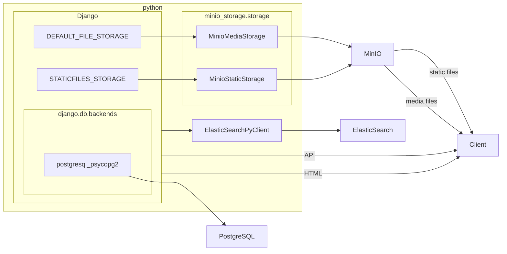
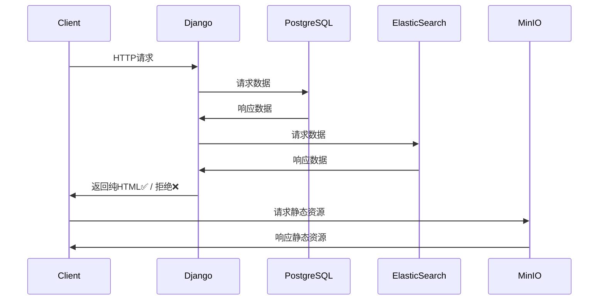
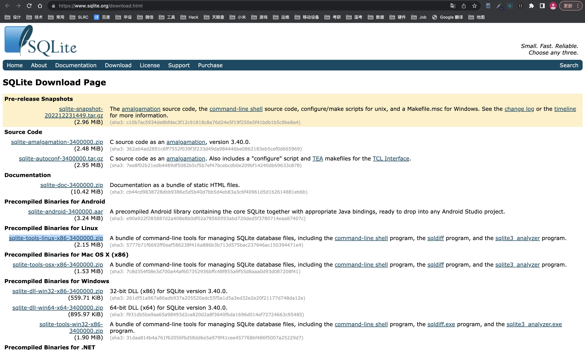

<div align="center">
  
  <div>简体中文 | <a href="./README.en.md">English</a></div>
  <p>
    基于Django3.2.7+Vue2+ElementUI的相对比较自动化生成的后台管理系统。借助SimpleUI开源项目对Django原生的Admin后台管理页面进行了二次开发和优化改进而生成的比较现代化的后台管理系统。
  </p>
</div>


## 模块&功能
本项目总共有六大模块组成.其分别是：
### 万能堡垒
<table>
<tr>
<td>大模块</td>
<td>子模块</td>
<td>微模块</td>
<td>功能</td>
<td>是否已实现</td>
</tr>


<tr>
<td rowspan="3">设备管理</td>
<td rowspan="3">网络设备管理</td>
<td>服务器管理</td>
<td>········</td>
<td>✅</td>
</tr>
<tr>
<td>路由器管理</td>
<td>········</td>
<td>✅</td>
</tr>
<tr>
<td>转换器管理</td>
<td>········</td>
<td>☑️</td>
</tr>
<tr>


<td rowspan="3">网络管理</td>
<td >网段管理</td>
<td>········</td>
<td>········</td>
<td>✅️</td>
</tr>
<tr>
<td>IP地址管理</td>
<td>········</td>
<td>········</td>
<td>✅️</td>
</tr>
<tr>
<td>穿透管理</td>
<td>········</td>
<td>········</td>
<td>☑️</td>
</tr>


<tr>
<td rowspan="4">服务管理</td>
<td>SSH服务</td>
<td>········</td>
<td>········</td>
<td>✅</td>
</tr>
<tr>
<td>数据库管理</td>
<td>········</td>
<td>········</td>
<td>✅</td>
</tr>
<tr>
<td>宝塔管理</td>
<td>········</td>
<td>········</td>
<td>✅</td>
</tr>
<tr>
<td>ES管理</td>
<td>········</td>
<td>········</td>
<td>✅</td>
</tr>

</table>

### 资金管理

<table>
<tr>
<td>大模块</td>
<td>子模块</td>
<td>功能</td>
<td>子功能</td>
<td>是否已实现</td>
</tr>


<tr>
<td>银行卡管理</td>
<td>········</td>
<td>········</td>
<td>········</td>
<td>✅</td>
</tr>

<tr>
<td>信用卡管理</td>
<td>········</td>
<td>········</td>
<td>········</td>
<td>✅</td>
</tr>

<tr>
<td>债务管理</td>
<td>········</td>
<td>········</td>
<td>········</td>
<td>✅</td>
</tr>

<tr>
<td>流水管理</td>
<td>········</td>
<td>········</td>
<td>········</td>
<td>✅</td>
</tr>

</table>

### 社工库

<table>
<tr>
<td>大模块</td>
<td>子模块</td>
<td>功能</td>
<td>子功能</td>
<td>是否已实现</td>
</tr>


<tr>
<td rowspan="1">基本自然人信息</td>

<td>········</td>
<td>········</td>
<td>········</td>
<td>✅</td>
</tr>


<tr>
<td rowspan="6">媒体账号信息</td>
<td rowspan="4">微博</td>
<td rowspan="3">采集</td>
<td>自动采集</td>
<td>✅️</td>
</tr>
<tr>
<td>定时采集</td>
<td>✅️</td>
</tr>
<tr>
<td>指定范围采集</td>
<td>✅️</td>
</tr>

<tr>
<td rowspan="1">统计&分析</td>
<td>数据可视化</td>
<td>✅️</td>
</tr>

<tr>
<td>抖音</td>
<td>········</td>
<td>········</td>
<td>✅️</td>
</tr>

</table>

### 账号管理

* 通用账号管理
* 平台管理

### 媒体库

* 媒体存储媒体
* 基于人脸识别的资源分类

### iCloud内容管理


## 未来期望
* 人脸识别

  参考项目:
    * [face-detect-api](https://github.com/urandu/face_detect_api)

## 架构实现



## 核心依赖

### 1. Django集成式多功能后端框架

[](https://github.com/Haoke98/DjangoAsnycAdmin)

### 2. FFmpeg

为了实现icloud相关视频处理功能需要用到FFmpeg作为核心。

[](https://github.com/FFmpeg/FFmpeg)


## 🌱 使用教程

先在izbasar目录下新建一个secret.py文件

```python
_DEBUG = False

SECRET_KEY = ''
ADMIN_PATH = ''
ADMIN_USERNAME = ""
ADMIN_PASSWORD = ""
JWT_SIGNATURE = SECRET_KEY
JWT_ISSUER = ""

ES_USERNAME = ""
ES_PASSWORD = ""
ES_URI = "https://127.0.0.1:9002"
ES_CA = "/usr/etc/http_ca.ctr"

SMTP_EMAIL = ""
SMTP_PASSWORD = ""

MEDIA_ROOT = "/home/media"
```
再执行以下命令来产生数据库文件
```shell
python manage.py makemigrations
python manage.py migrate
```
再执行以下命令来运行项目即可
```bash
# 直接console运行
python manange.py runserver 7000
# 后台运行
nohup python manange.py runserver 7000 > app.log 2>&1 & echo $! > app.pid
```


### Nginx 配置实现媒体文件的缩略图功能
nginx 下载地址 http://nginx.org/en/download.html

编译参数：--with-http_image_filter_module
```editorconfig
http{
    ...
    server{
        ...
        location /icloud-shortcut {
            video_thumb;
            image_filter resize 100 200;
            image_filter_jpeg_quality 80;
            alias /external/SADAM/icloud/photos;
            autoindex on;
        }
        location /icloud {
            alias /external/SADAM/icloud/photos;
            autoindex on;
        }
        ...
    }
    ...
}
```
### 配置系统服务并开启自启动
先创建allkeeper.service文件并复制allkeeper.service.sample的内容
```shell
cp allkeeper.service.sample allkeeper.service
```
再修改内容, 再移到系统服务单位存储目录
```shell
vi allkeeper.service
mv allkeeper.service /usr/lib/systemd/system/
```
加载新加入的服务单位
```shell
systemctl daemon-reload
```
启动服务
```shell
systemctl start allkeeper.service
```
开启开机自启动
```shell
systemctl enable allkeeper.service
```

### 开启数据库定时备份
#### 1. 首先，创建一个备份脚本（例如：backup_mysql.bat（Windows）或backup_mysql.sh（Linux）），包含以下内容：

Windows脚本（backup_mysql.bat）：
```shell
@echo off
For /f "tokens=2-4 delims=/ " %%a in ('date /t') do (set mydate=%%c-%%a-%%b)
For /f "tokens=1-2 delims=/:" %%a in ("%TIME%") do (set mytime=%%a%%b)
set mydatetime=%mydate%_%mytime%
set BackupFile=backup_directory\backup_%mydatetime%.sql
"mysql_install_directory\bin\mysqldump.exe" -u USERNAME -pPASSWORD DATABASE_NAME > %BackupFile%
```
Linux脚本（backup_mysql.sh）：
```shell
#!/bin/sh
script_path="$(dirname "$(readlink -f "$0")")"
echo "当前脚本所在路径：$script_path"
backup_dir=${script_path}/backup_sql
mkdir -p $backup_dir
mysqldump -u all_keeper -p 1_nDb9tk0pwa all_keeper > ${backup_dir}/all-keeper_`date +%Y%m%d%H%M%S`.sql
```
将backup_directory替换为您想存储备份文件的目录

将mysql_install_directory替换为MySQL安装目录

使用真实的数据库用户名代替USERNAME

使用真实的数据库密码代替PASSWORD

使用要备份的数据库名称代替DATABASE_NAME

#### 2. 为脚本设置可执行权限（仅在Linux上需要）：
```shell
chmod +x backup_mysql.sh
```
#### 3. 创建一个定时任务（Windows Task Scheduler或Linux的cron）：
a) Windows定时任务：

打开任务计划程序
单击"创建基本任务"，然后设置触发器（例如：每天、每周等），并选择刚创建的备份脚本作为要执行的操作。

b) Linux的cron任务：

在终端中键入crontab -e以编辑cron配置
添加以下内容（根据实际情况修改）：
```shell
0 2 * * * /path/to/backup_mysql.sh
```
这将在每天凌晨2点执行备份任务。请将/path/to替换为脚本的实际路径。

## 常见问题
### 问题一:下拉框选择列表获取失败
现在Windows上执行一下命令
```shell
python3 manage.py collectstatic
```
然后执行一下命令
```shell
scp -rC /Users/shadikesadamu/Projects/izbasar/django-admin/public root@192.168.1.100:/root/AllKeeper/
```
### 问题二：Sqlite版本异常1
> 异常：django.core.exceptions.ImproperlyConfigured: SQLite 3.9.0 or later is required (found 3.7.17).

解决方案：
1. 首先检查确认现有版本：
```shell
sqlite3 --version
```
2. 其次安装正确版本的sqlite（如报错提示，必须大于等于3.9.0)

从SQLite官网下载最新版本的软件包
```shell
wget https://www.sqlite.org/2022/sqlite-autoconf-3400000.tar.gz
tar -xvzf sqlite-autoconf-3400000.tar.gz 
cd sqlite-autoconf-3400000.tar.gz
./configure
make && make install
echo export LD_LIBRARY_PATH="/usr/local/lib">> ~/.bashrc
```

### 问题三：Sqlite3版本异常2
> 异常：django.db.utils.NotSupportedError: deterministic=True requires SQLite 3.8.3 or higher
> 
> 升级了 sqlite 版本（因 django 怕改动太大就没有尝试卸载django重新安装的方法）。
如下，明明版本已经更新成最新了环境变量也加了，软链接指向也是最新了，可运行还是提醒版本过低。
> 
> 可能是不支持新的版本，最终决定更换sqlite3 为pysqlite3 和 pysqlite3-binary

解决方案：
1. 安装pysqlite3和pysqlite3-binary
```shell
pip install pysqlite3
pip install pysqlite3-binary
```
2. 打开文件/usr/local/python3/lib/python3.8/site-packages/django/db/backends/sqlite3/base.py，找到 from sqlite3 import dbapi2 as Database 注释它，添加代码
```python
#from sqlite3 import dbapi2 as Database  #注释它
from pysqlite3 import dbapi2 as Database #新加这段代码
```
## 感谢巨人

<a title="Python" href="https://www.python.org/" target="_blank">

</a>
<a title="ElasticSearch" href="https://www.elastic.co/cn/" target="_blank">

</a>
<a title="Django" href="https://www.djangoproject.com/" target="_blank">

</a>
<a title="SimpleUI" href="https://simpleui.72wo.com/docs/simpleui/" target="_blank">

</a>

## 杰出贡献者

<a href="https://gitee.com/sadam98" target="_blank">
  
</a>

## 联系我们

- 如果二次开发或者部署过程中有什么问题，可以随时联系我们。
<table>
<tr>
<td>

</td>
</tr>
</table>

## 友情链接
